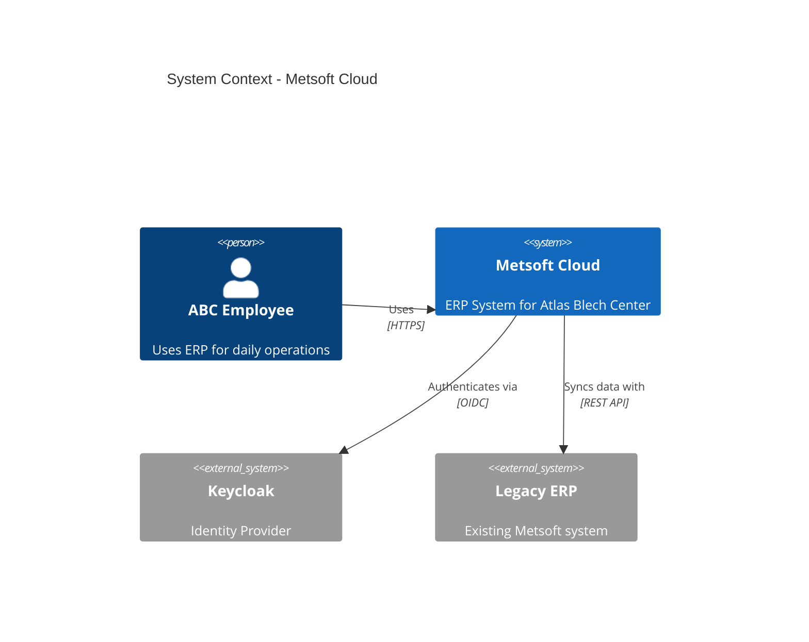
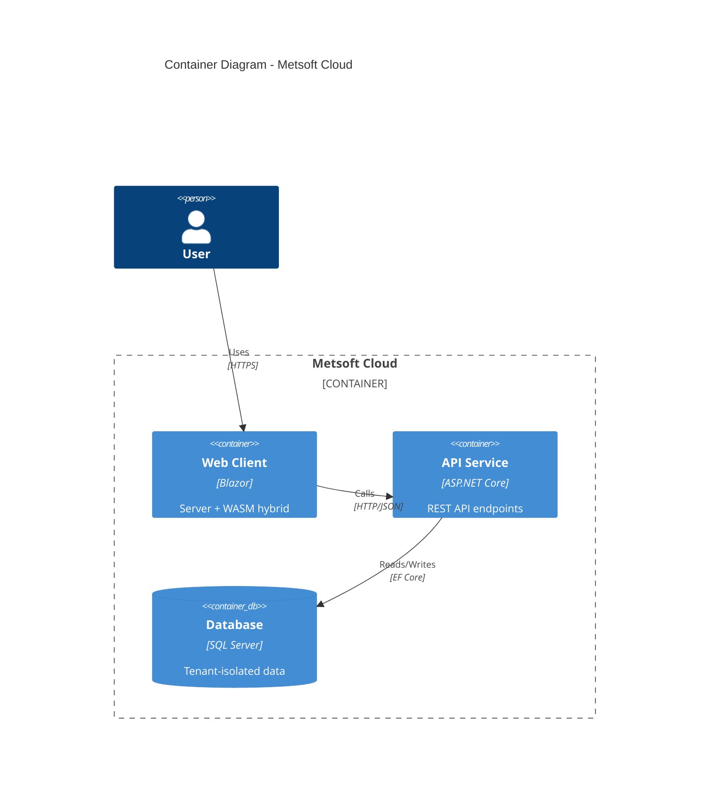

# Architecture Documentation

Patterns for documenting system architecture, decisions, and diagrams.

---

## Architecture Decision Records (ADRs)

Store in `docs/architecture/adr/` with format `NNNN-title-in-kebab-case.md`.

**Template:** Use [assets/adr-template.md](../assets/adr-template.md)

### ADR Lifecycle

```
Proposed → Accepted → [Superseded | Deprecated]
```

| Status | Meaning |
|--------|---------|
| Proposed | Under discussion, not yet decided |
| Accepted | Decision made and being implemented |
| Deprecated | No longer relevant |
| Superseded | Replaced by another ADR |

---

## Module Documentation

Every module MUST have documentation in `docs/architecture/modules/{module}.md`.

**Template:** Use [assets/module-template.md](../assets/module-template.md)

### What to Document

Document only what's **not** in the code:

| Document | Don't Document (in code) |
|----------|-------------------------|
| Purpose/Why | API Endpoints (→ OpenAPI) |
| Boundaries (owns/references/publishes) | Database Schema (→ Migrations) |
| Key design decisions | Aggregate behaviors (→ Domain) |
| Cross-module dependencies | Invariants (→ Domain) |
| Known limitations, gotchas | |

---

## C4 Model Diagrams

Use C4 model for architecture visualization in `docs/architecture/`.

| Level | File | Audience |
|-------|------|----------|
| Context | `system-context.md` | Everyone |
| Container | `containers.md` | Technical |
| Component | `components/{module}.md` | Developers |

### Mermaid C4 Examples

**System Context Diagram:**



**Container Diagram:**



Use Mermaid C4 syntax:
- `C4Context` for system context
- `C4Container` for container diagrams
- `C4Component` for component diagrams

---

## Sequence Diagrams

For complex flows, store in `docs/architecture/flows/`.

Use Mermaid `sequenceDiagram` syntax for:
- Cross-module workflows
- External system integrations
- Async event flows

---

## Documentation Location

| Artifact | Location |
|----------|----------|
| ADRs | `docs/architecture/adr/` |
| System Context | `docs/architecture/system-context.md` |
| Container Diagram | `docs/architecture/containers.md` |
| Module Docs | `docs/architecture/modules/{module}.md` |
| Sequence Diagrams | `docs/architecture/flows/` |
